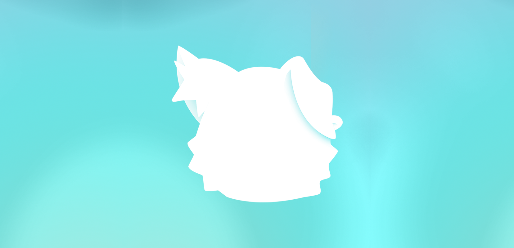

<div align="center">
  <a href="https://github.com/roeegh/Puck">
    
  </a>
  
  <h3 align="center">Puck</h3>
  <p align="center">
    A collection of customizations ready to use with Misaka
  </p>
</div>

# Prerequisites

1. Misaka
2. MacDirtyCow compatbile device

# How to use it?

Add the following repository to Misaka:

```
https://puck.roeegh.dev/repo.json
```

# How to customize?

1. Navigate to the `Packages` tab in Misaka
2. Select `Tweak Settings` by pressing and holding on the tweak you want to edit
3. Change the values to your preference
   <br></br>

# Tweaks

### Notification Shadow

Adds a colored shadow to notification banners, pill notifications and Siri results (dark mode only)

Original File Paths:

-   Light Mode: `/System/Library/PrivateFrameworks/PlatterKit.framework/platterVibrantShadowLight.visualstyleset`

-   Dark Mode: `/System/Library/PrivateFrameworks/PlatterKit.framework/platterVibrantShadowDark.visualstyleset`

<details><summary>Screenshots</summary>

|                        Banner (Light)                        |                        Banner (Dark)                        | Pill (Light)                                               | Pill (Dark)                                               | Siri                                               |
| :----------------------------------------------------------: | :---------------------------------------------------------: | ---------------------------------------------------------- | --------------------------------------------------------- | -------------------------------------------------- |
|  |  |  |  |  |

</details>

### Notification Color

Change the color of your notifications and battery widget

Original File Paths:

-   Light Mode: `/System/Library/PrivateFrameworks/CoreMaterial.framework/platters.materialrecipe`

-   Dark Mode: `/System/Library/PrivateFrameworks/CoreMaterial.framework/plattersDark.materialrecipe`

<details><summary>Screenshots</summary>

|                        Notification Center (Light)                         |                        Notification Center (Dark)                         | Notification Banner (Light)                                                | Notification Banner (Dark)                                                | Battery Widget (Light)                                                | Battery Widget (Dark)                                                |
| :------------------------------------------------------------------------: | :-----------------------------------------------------------------------: | -------------------------------------------------------------------------- | ------------------------------------------------------------------------- | --------------------------------------------------------------------- | -------------------------------------------------------------------- |
|  |  |  |  |  |  |

</details>

# Acknowledgments

-   Icon & Banner by [taki](https://twitter.com/74k1_)
